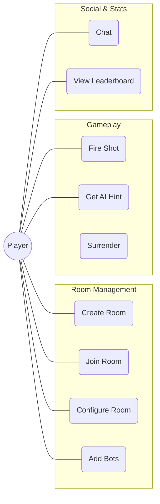
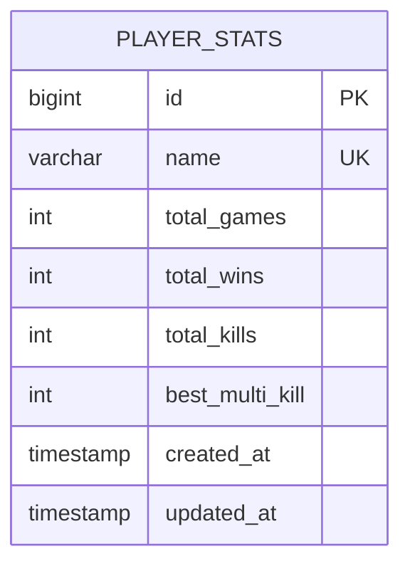

# Diagram Sources for Graphwar Report

Use these codes to generate images at [Mermaid Live Editor](https://mermaid.live).
Save the images as `.png` files in this directory: `latex_report/`.

## 1. usecase_diagram.png

## 2. erd_diagram.png

